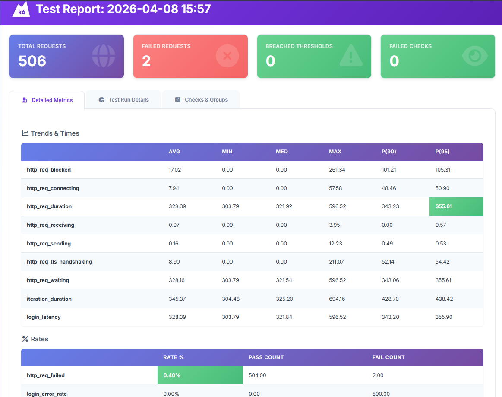
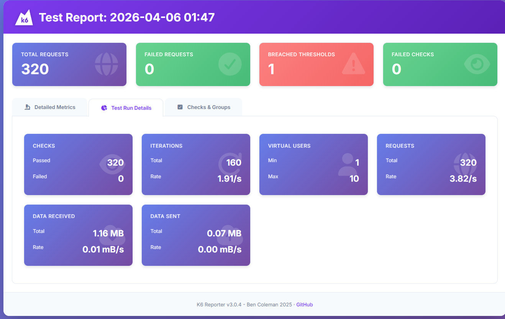
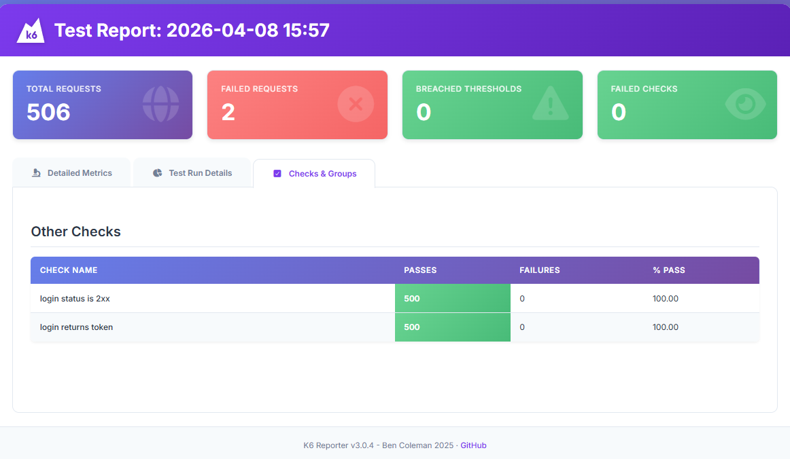

# fakestore-performance-k6-test

Proyecto de pruebas de rendimiento con k6 para validar el API de Fakestore en el flujo de login.

## Qué se hizo
- Automatización de la prueba de login en [tests/login-load.test.js](tests/login-load.test.js) usando el executor `constant-arrival-rate`.
- Lectura de credenciales desde [data/credentials.csv](data/credentials.csv).
- Validación de respuestas HTTP 2xx y presencia de token.
- Generación de reportes JSON y HTML dentro de [results/](results).
- Uso de métricas personalizadas para latencia y errores.
- Definición de umbrales para p95, tasa de error y TPS efectivo.

## Herramientas usadas
- k6
- k6-reporter
- JavaScript ES Modules

## Ejecución
Desde la raíz del proyecto:

```powershell
k6 run tests/login-load.test.js
```

Para ejecutar con la configuración validada:

```powershell
$env:LOGIN_DURATION='20s'
$env:LOGIN_RATE='25'
$env:LOGIN_PRE_ALLOCATED_VUS='80'
$env:LOGIN_MAX_VUS='150'
k6 run tests/login-load.test.js
```

Los resultados se generan en:
- [results/login-summary.json](results/login-summary.json)
- [results/login-summary.html](results/login-summary.html)

## Configuración
La configuración principal está en [config/config.js](config/config.js). Desde ahí se definen:
- `BASE_URL`
- `LOGIN_PATH`
- `CREDENTIALS_FILE`
- el escenario de carga
- los umbrales de rendimiento

También puedes sobrescribir valores con variables de entorno:
- `BASE_URL`
- `LOGIN_PATH`
- `CREDENTIALS_FILE`
- `LOGIN_RATE`
- `LOGIN_RATE_UNIT`
- `LOGIN_DURATION`
- `LOGIN_PRE_ALLOCATED_VUS`
- `LOGIN_MAX_VUS`

## Evidencia visual
### Reporte de ejecución






## Ejercicio 2
El análisis de resultados del ejercicio 2 está documentado en [InformeResultados.docx](InformeResultados.docx).
